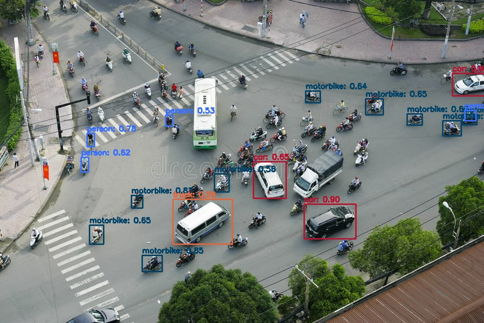

## 🚀 Phát Hiện Đối Tượng với YOLOv3 và OpenCV (Python)

Đây là một dự án đơn giản nhưng mạnh mẽ để thực hiện phát hiện đối tượng theo thời gian thực (hoặc trên ảnh tĩnh) bằng thuật toán YOLOv3 (You Only Look Once) và module DNN (Deep Neural Network) của thư viện OpenCV.



### 🎯 Tính Năng Chính

- Phát hiện 80 lớp đối tượng khác nhau (dựa trên bộ dữ liệu COCO).
- Sử dụng module OpenCV DNN hiệu quả để tải và chạy mô hình.
- Tích hợp Non-Maximum Suppression (NMS) để lọc các hộp giới hạn trùng lặp, đảm bảo kết quả chính xác.
- Lưu kết quả phát hiện vào file ảnh đầu ra.

### 🛠️ Yêu Cầu và Cài Đặt

#### 1. Yêu Cầu Thư Viện

Bạn cần cài đặt Python (phiên bản 3.6 trở lên) và các thư viện sau:

```bash
pip install opencv-python numpy
```

#### 2. Tải File Mô Hình (Assets)

Để mô hình hoạt động, bạn cần ba file cấu hình và trọng số cơ bản. Hãy tải chúng và đặt vào cùng thư mục với file `main.py` hoặc `yolo_detector.py` của bạn.

| File           | Mô tả                                       | Lệnh Tải (Linux/macOS)                                                                                                |
| -------------- | ------------------------------------------- | --------------------------------------------------------------------------------------------------------------------- |
| yolov3.weights | Trọng số đã học (đã được tối ưu cho OpenCV) | `wget https://github.com/AlexeyAB/darknet/releases/download/darknet_yolo_v3_optimal/yolov3.weights -O yolov3.weights` |
| yolov3.cfg     | Cấu trúc kiến trúc mạng Darknet             | `wget https://raw.githubusercontent.com/pjreddie/darknet/master/cfg/yolov3.cfg`                                       |
| coco.names     | Tên của 80 lớp đối tượng                    | `wget https://raw.githubusercontent.com/pjreddie/darknet/master/data/coco.names`                                      |

### ⚙️ Cách Sử Dụng

#### 1. Chuẩn bị Ảnh Đầu Vào

- Đặt ảnh bạn muốn kiểm tra vào thư mục dự án (ví dụ: `test_image.jpg`).
- Kiểm tra và cập nhật biến đường dẫn ảnh trong file `yolo_detector.py` hoặc `main.py` nếu tên ảnh của bạn khác mặc định.

#### 2. Chạy Mã

Thực thi tập lệnh Python chính trong Terminal/Command Prompt:

```bash
python main.py
# hoặc nếu bạn dùng tên khác
python yolo_detector.py
```

#### 3. Kết Quả

- Một cửa sổ OpenCV sẽ bật lên hiển thị ảnh với các hộp giới hạn và nhãn của đối tượng được phát hiện.
- Ảnh kết quả (Output) sẽ được lưu lại trong cùng thư mục với tên `output_result.jpg`.
- Thời gian xử lý (Inference) sẽ được in ra trên Terminal.

### ✏️ Tùy Chỉnh

Bạn có thể chỉnh sửa các tham số sau trong file `yolo_detector.py`/`main.py` để thay đổi độ nhạy và hiệu suất của mô hình:

| Tham số         | Giá trị mặc định | Ý nghĩa                                                                                         |
| --------------- | ---------------- | ----------------------------------------------------------------------------------------------- |
| CONF_THRESHOLD  | 0.5              | Ngưỡng tin cậy. Chỉ giữ lại các dự đoán có điểm số cao hơn.                                     |
| NMS_THRESHOLD   | 0.4              | Ngưỡng Non-Maximum Suppression. Giá trị thấp hơn giúp loại bỏ nhiều hộp giới hạn chồng lấn hơn. |
| YOLO_INPUT_SIZE | 416              | Kích thước đầu vào của mạng (nên là bội số của 32, ví dụ: 320, 416, 608).                       |

### 🧑‍💻 Tác Giả

XaiDet - Người triển khai dự án.

Nếu bạn có bất kỳ câu hỏi nào hoặc muốn mở rộng dự án này, đừng ngần ngại hỏi nhé! Chúc bạn thành công!
